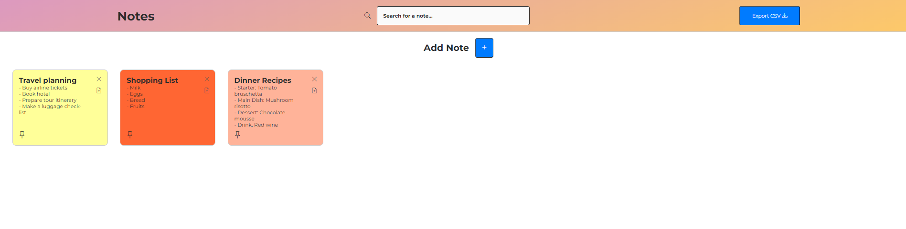

<h1 align="center" style="font-weight: bold;"> NotesApp </h1>


<p align="center">
 <a href="#tech">Technologies</a> • 
 <a href="#started">Getting Started</a> • 
 <a href="#contribute">Contribute</a> •
 <a href="#license">License</a>
</p>

<p align="center">
<b>Notes App is a simple notes management application that allows users to create, delete, duplicate, correct and search notes efficiently and intuitively.</b>
</p>

<p align="center">
    
    
</p>


<h2 id="tech">Technologies</h2>

### Client:
  Built using [HTML, CSS, Javascript](https://developer.mozilla.org/pt-BR/docs/Web/JavaScript), this interface and the layout ware made from scratch by me.


<h2 id="started"> Getting Started</h2>

<h4> Functionalities</h4>

- Create notes
- Duplicate 
- Delete
- Pin and unpin
- To color
- Search
- Export CSV


<h2 id="contribute">Contribute</h2>

If you want to contribute, clone this repo, create your work branch and get your hands dirty!

```bash
git clone https://github.com/SimoneGabionetta/note
git checkout -b feature/NAME
```

<h2 id="license">License</h2>

This project is under [MIT](./.github/LICENSE) license